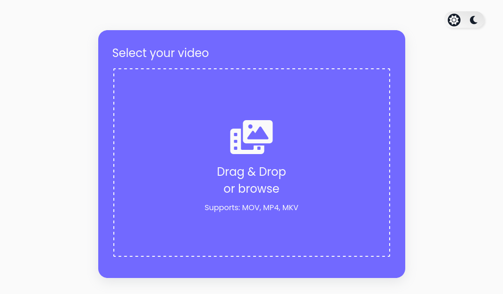

# ⭐ Overthrow 

The drag and drop functionality supports three events drop, dragover and dragleave. When you drag any image file over the drag area, the border of the container will change to solid, and the text "Drop to Upload file" will be changed to "Release to upload file". When you'll leave the dragarea, the things will go back to default state due to "dragleave event". When you'll drop the file over the drag area or simply browse the file then it'll run validation on file extension 

Dark & Light theme : CSS custom properties are also referred to as CSS variables. For example, you can define CSS variables at the document root, and this will help us managing the wide variety of colors used in Light/Dark toggle functionality. CSS animations are also used in order to make toggle more attractive

## Demo

**Link** : https://shubhdeeprose.github.io/overthrow

## Features

- Light / Dark mode toggle
- Drag / Drop file functionality
- File Extension Validation 
- Responsive

## Lessons Learned

This is my first step in the journey towards a career in full-stack web development.

* CSS Media Queries
* CSS Variables
* CSS Animations
* Responsive Web Design
* Git / Github
* Vanilla JS - Arrow Functions, Event Listners

## Tech Stack

![HTML][html-shield]

![CSS][css-shield] 

![JS][js-shield]

[html-shield]: https://img.shields.io/badge/HTML5-E34F26?style=for-the-badge&logo=html5&logoColor=white
[css-shield]:https://img.shields.io/badge/CSS3-1572B6?style=for-the-badge&logo=css3&logoColor=white
[js-shield]:https://img.shields.io/badge/JavaScript-F7DF1E?style=for-the-badge&logo=javascript&logoColor=black
